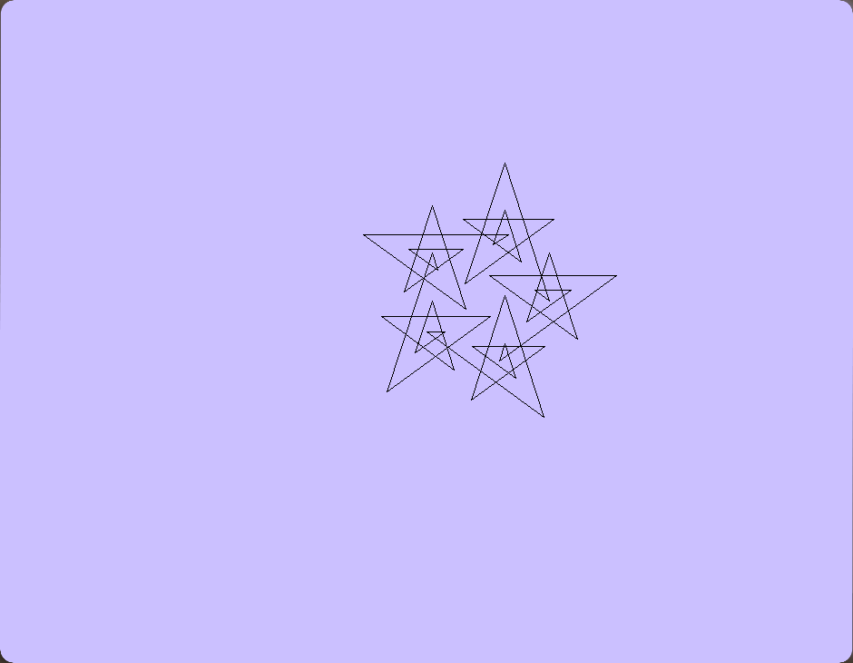

# Turtle Graphics Project.
## By David Owairu
## S5315959

# Introduction
## Summary
Turtle graphics is a vector drawing program first implemented in logo around the late 1960's. it uses a 2D coordinate system to make a turtle robot or agent draw complex shapes using simple lines. It has been added as part of Pythons standard library and has even been implemented into three dimensions in the java version.

The goal of this project was to create our own turtle graphics library using the SDL2 library and the C programming language. Our turtle should be able to perform the very basic turtle commands such as forward (), backward(), penup(), pendown(), left(), right() etc. It should also be able to produce Spiro laterals, after being given factors like the drawing angle, the number of line segments and the number of iterations.

## Technique
When it comes to programming techniques, I mainly used procedural programming but also used a little bit of structural programming wherever I felt making a separate procedure was not necessary. I started most of my core functionality with structural programming and slowly converted functions that I would call repeatedly into procedural functions (That's one of its main advantages). This also increases the readability of the program. A prime example of this is my image loading function. I started in my main function and used it to load the primitive version of my UI. I then extracted it into a proper function and used it to load my main Ul and the various menus it has whenever they were needed.

I also made extensive use of iterations like for loops and while loops. The while loops were especially important for allowing SDL to constantly listen for events like keyboard presses and mouse events etc. I would not have been able to complete my program without using for loops. The main functionality of the program requires the user to be able to choose the number of loops/iterations that the turtle should go through. They were very important in making the Spiro laterals work.

## Algorithms and program flow
The structure and flow of my program is not very complicated. It has only one main entry point(main function). And one library with its accompanying .c and.h files. After completing all the turtle functions, I created turtle.c and turtle.h with their relevant function definitions and prototypes and linked them in with the executable along with all the other necessary SDL libraries in the makefile. This really helps keep the program a lot more organised and readable, although it is a bit more tedious to manage in terms of changing function parameters and prototypes. The makefile uses clang for compilation and a few macros and flags for easy editing. The compiler can be changed by changing the CC flag in the makefile.

I thought about extracting my other functions, for loading images, loading the UI, menu control, value conversion etc into their own library as well but I did not think it was necessary in the end as the focus of the project is the turtle library.
Below is a flowchart showing my program structure.

# IMPLEMENTATION
Before I got down to programming, I did a little bit of planning. I created a rough mind map of what I thought the structure of the program would look like as well as the most important functions that I would need. The final program ended up looking a little different as I added or removed elements that I may have initially thought were important or needed.

## Initialising SDL and Turtle struct
Based on my rough plan I stared with initializing SDL2, following the slides provided by Dr. Eike Anderson, I was able to initialize a window, renderer and main event loop which allowed me to open a window to manipulate.

After successfully creating a window I started working on the struct for my turtle, I worked on this first because it would be the basis for all my other functions and it would allow for easy manipulation of the turtles' parameters and values. I defined the following parameters for the turtle.
- Starting x position
- Starting y position
- Ending x position
- Ending y position
- Angle
- Colour
- No. Of lines
- No. of loops

I proceeded to create a function called initturtle 0 that would initialise a turtle struct variable with the default values set in the function. This was to simplify the process of giving the struct variable values when created. I realise that I could have done this in the creation of the structure, but I wanted to have a bit more control over how certain values within the struct were initialised like the x and y starting positions.

## Rough UI, Surfaces, and images
A big part of the turtle graphics library is having some sort of window or user interface to draw to, because I had already worked out (on paper) what the basic functions of the turtle required and how they worked, I started working on the user interface. I decided I would work on the turtle functions alongside user input because the program needs to allow the user to change the parameters of the turtle either though the console or the UI.

I started by reading through the sdl2 and sdl2_image API's on surfaces, rectangles, images and some of their related functions. I then followed a quick tutorial from Gigi labs on rendering an image to the window using surfaces, textures, and rectangles. When I first initialised my window, I used some temporary variables to control the width and height, but after learning about rectangles I created some SDL_Rect variables to control the window size and other parts of my User interface such as the drawing area. I used these rect variables and the SDL_RenderFillRect function to make a rough layout of my UI.

With the rough layout of the UI in place I took my measurements started making the user interface in photoshop. I made the first Ul extremely simple because I wanted to complete the turtle functions and user input before finalising anything. I created an image loading function and called it within a Ul loading function, to get my Ul images on the screen as well as my drawing surfaces. After creating the image and Ul loading functions, an image saving function was created with relative ease making use of SDL_RenderRead Pixels(), the SDL_image library and some help from "TalesM" on stack overflow. (TalesM, 2014)

## The turtle functions.
I started with the main draw function. I knew for this I would have to be able to draw lines in any direction using the angle and length of said line. This can be solved using some simple trigonometry. We have the angle, the length of the hypotenuse and the starting x and y values. To find x and y we can use their corresponding sides of the triangle, x
= adjacent and y = opposite therefore we can find x by making it the subject of the formula in cos(angle)=x/hyp (CAH) and do the same for sin(angle)=y/hyp (SOH). This leaves us with.
- X=hypotenuse * cos(angle)
- Y=hypotenuse * sin(angle)

I Made functions to convert from degrees to radians and vice versa, because <math.h> uses radians to calculate angles using sin and cos, this was to make it easier for me to test the program as well as to simplify it for the end user.

In the first iteration of this draw function, I used the updated version of Bradenham's line algorithm that allows you to draw lines in the negative y direction. I later used SDL's built-in line function (SDL_RenderDrawLine) for simplicity. I adapted the draw function into two separate functions forward() and backward () and moved one to create the other functions.

The following functions just take the turtle in as input and increase/decrease the relevant value. Some of them like left and right take in an extra value because they conflicted with the turtle's ability to draw.
- Left()
- Right()
- Loopcycle()
- Linecycle()

In terms of the colour function, I wanted it to work in a similar way to the colour function in pythons turtle module, where it can take the name of the colour and extract the r, g, and b values from there. I was helped by unit lecturer Dr.Eike Anderson to make this function.

## Finalising input and UI
Once I had all my turtle functions, I created an SDL_Keydown() event in the event loop to listen for keys being pressed. After that it was just a case of calling the relevant function for the relevant key.

At this stage I was ready to finalise my UI, So I finished it in photoshop and created a few menus to make the user experience a bit better. I managed the menus using functions containing event loops, this way I would still be able to listen for buttons within menu's, this allows the user to choose options while in a menu. For example, in the save menu the user can choose 1,2 or 3 to save their image in .PNG, JPG and.BMP respectively. I had this idea suggested to me by my colleague Peter Dravecky.

## Testing
Throughout the development of the program, whenever I made any significant changes that could impact the program in any way, I would test it,then debug it if there were any problems. So far, the program could successfully create lines and shapes with different colours and sizes, but I had not attempted to use it to create any of the Spiro
laterals. Using the documentation provided by lecturer Eike Anderson on Spiro lateral(Krawczyk) I was able to properly test my code and ensure that all its basic functions came together to achieve the desired result. This is the point in the program where I had to add an external angle variable to input into the left() and right() functions because it did not work otherwise.

## Results
Although I am very happy with the results of this assignment, there is one bug that I was unable to figure out. My image saving function works fine but the colours in the images it saves are inconsistent with the colours seen on screen. Sometimes it will produce the correct colours and other times it will not. I do not know why this happens, but I suspect it has something to do with the surface and rectangle I am using to save my images and the way that colours have been implemented. 

Pictures of successful drawings

## References
htmlcolorcodes.com. (2015-2020). HTML Color Names. Retrieved January 16, 2021, from
https://htmlcolorcodes.com/color-names/
Krawczyk, R. J. (n.d.). SPIROLATERALS, COMPLEXITY FROM SIMPLICITY. Illinois Institute of Technology, College of Architecture. Retrieved January 16, 2021, from http://mypages.iit.edu/~krawczyk/isama99.pdf
Labs, G. (2015). SDL2 Tutorials. Retrieved December 20, 2020, from https://gigi.nullneuron.net/gigilabs/writing/sdl2- tutorials/
SDL. (n.d.). SDL 2.0 API by Category. Retrieved Dcember 16, 2020, from https://wiki.libsdl.org/APIByCategory
TalesM. (2014). SDL2 C++ Taking a screenshot. stackoverflow. Retrieved January 17, 2021, from https://stackoverflow.com/questions/22315980/sdl2-c-taking-a-screenshot/22339011#22339011

#User Manual